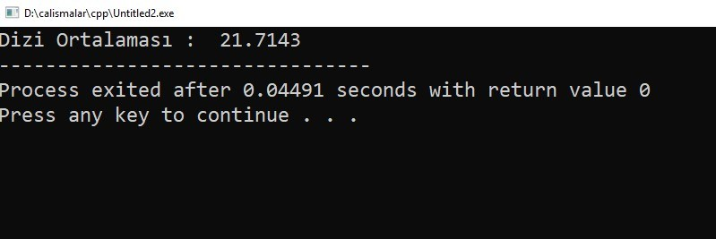
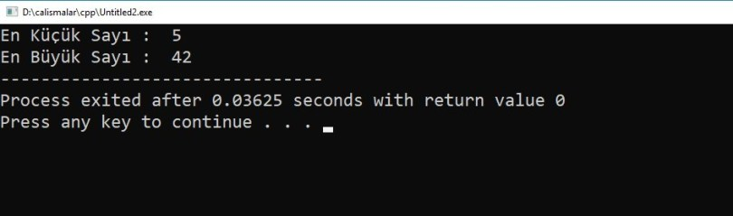

= C++

== C++ Nedir? 

C++, 1979'da  Bell Labs’da Bjarne Stroustrup tarafından geliştirilen orta düzey bir programlama dili olarak geliştirilmiştir.

C++ ; Windows, Mac OS ve çeşitli UNIX sürümleri gibi çeşitli platformlarda çalışır.

C++ statik olarak geliştirilmiş, genel amaçlı büyük küçük harf duyarlı prosedürel ve nesne yönelimli programlamayı destekleyen bir dildir.

C++ yüksek ve düşük seviyeli programlama dilleri özelliklerini barındırdığı için orta seviyeli bir dildir.

C++, C dili üzerine geliştirildiği için C dilinin bir kalıtımıdır.

== C++ Program Yapısı

Her progralama dilinde olduğu gibi Merhaba Dünya yazısı ile dilin yapısını inceleyelim.

[source, c++]
----
#include <iostream>
using namespace std;
 
// main() main programı çalıştıran ana metotdur. 
int main() {
   cout << "Merhaba Dunya"; //Ekrana merhaba dunya yazdırılır
   return 0;
}
----

Aşağıdaki örnekte de değişken tanımlama ve bu değişkenlere değer atama işlemini görebiliriz.

[source, c++]

----

#include <iostream>
using namespace std;
 
// Degisken tanimlama
extern int a, b;
extern float f;
 
int main () {
   // degisken tanimlama:
   int a, b;
   float f;
 
   // deger atama
   a = 10;
   b = 20;
 
   cout <<"toplam :" << a + b << endl ;
 
   f = 50.0/3.0;
   cout << "ondalik :" << f << endl ;
 
   return 0;
}

----

Değişken atama işlemlerini fonksiyon içerisinde de yapabiliriz.

[source, c++]

----
#include <iostream>
using namespace std;
 
// function beyani
int ornek();
int main() {
    
   // function cagirma
   int i = ornek();
}
 
// function tanımlama
int ornek() {
   return 125;
}
----

C++ programlama dilinde if, if else ve switch-case karar yapıları kullanılmaktadır.

İf else örneği aşağıdaki gibidir.

[source, c++]
----
#include <iostream>
using namespace std;
 
int main () {
   // degisken tanimlama
   int su_sicaklik = 110;
 
   // kosul kontrolu
   if( su_sicaklik < 0 ) {
      // algoritmaornekleri
      cout << "su buz halindedir" << endl;
   } else if(su_sicaklik <100) {
      //
      cout << "su sivi haldedir" << endl;
   }
   else
   {
       cout << "su gaz haldedir" << endl;
   }
 
   cout << "su sicakligi : " << su_sicaklik << endl;
 
   return 0;
}
----

For döngüsünün örneği aşağıdaki şekildedir.

[source, c++]
----
#include <iostream>
using namespace std;
int main (){
    int toplam = 0;
    for (int i = 5; i <= 1000; i++){
        if(i%2 == 0 || i%5 == 0)
            toplam += i;
    }
    cout << "Toplam" << toplam << endl;
    return 0;
}
----

C++ fonksiyon kullanımı bir fonksiyon yada diğer adı ile işlev, bir görevi yerine getiren bir ifadeler topluluğudur. 

Her C ++ programında adı main() olan en az bir fonksiyon bulunur ve tüm diğer küçük fonksiyonlar bu fonksiyona bağlanarak çalışır.

C++ da fonksiyon yapısı aşağıdaki şekildedir.

[source, c++]
----

dönüş_tipi fonksiyon_adı ( parametre listesi ) {
  fonksiyon gövdesi / yazılacak kodlar
}

----

Fonksiyon kullanımıyla ilgili örnek kod ise şu şekilde olmaktadır:

[source, c++]
----
#include <iostream>
using namespace std;
 
// fonksiyon bildirimi
int max(int num1, int num2);
 
int main () {
   // yerel değişken
   int a = 10;
   int b = 20;
   int sonuc;
 
   // fonksiyon çağırma
   sonuc= max(a, b);
   cout << "Iki sayidan buyuk olan deger : " << sonuc<< endl;
 
   return 0;
}
 
// fonksiyon tanimlama
int max(int num1, int num2) {
   // yerel değişken
   int s;
 
   if (num1 > num2)
      s= num1;
   else
      s= num2;
 
   return s; 
}
----

C++, aynı tipteki sabit boyutlu bir sıralı array koleksiyonunu saklayan bir veri yapısı dizisini sağlar. Bir veri topluluğununu depolamak için bir dizi kullanılır, ancak bir diziyi aynı türden değişkenlerin bir koleksiyonu olarak düşünmek genellikle daha yararlıdır.

Dizi kullanımıyla alakalı örnek kod aşağıdaki gösterilmiştir.

[source, c++]
----
#include <iostream>
using namespace std;
int main()
{
   setlocale(LC_ALL,"Turkish"); //Türkçe karakter
   int sayilar[5];
   for(int i=0;i<5;i++)
   {
   		cout<<i+1<<". Sayı : ";
   		cin>>sayilar[i];		
   }
}
----

Ekran Çıktısı: 

Dizi içindeki En Büyük ve En Küçük Değerli sayıları bularak ekranda gösteren  C++ kodu da aşağıda verilmiştir.

[source, c++]
----
#include <iostream>
using namespace std;
int main()
{
	setlocale(LC_ALL,"Turkish"); //Türkçe karakter
	int sayilar[]={5,10,15,13,15,22,42};
	int buyuk=sayilar[0];
	int kucuk=sayilar[0];
	int n = sizeof(sayilar) / sizeof(sayilar[0]);
    for(int i = 0; i < n; i++)
    {
    	if(sayilar[i]>buyuk);
    	{
    		buyuk=sayilar[i];
		}
		if(sayilar[i]<kucuk)
		{
			kucuk=sayilar[i];
		}
	}   
    cout<<"En Küçük Sayı :  "<<kucuk<<endl;
    cout<<"En Büyük Sayı :  "<<buyuk;
}
----

Ekran Çıktısı:

C++ bize iki tip string yapısı sunmaktadır.

. Birincisi C stili karakter dizeleri
. Diğeri ise C++’da standart olarak tanımlı string sınıfıdır.

C stili karakter dizesi C dilinde var olan ve C++ içinde desteklenmeye devam eden ‘\0’ boş karakterle sonlanan tek boyutlu bir karakter dizisidir. Karakter dizleri oluşturulduğunda dize sonuna konulmasa bile program tarafından bu sonlandırma işareti konulacaktır.

[source, c++]
----
#include <iostream>
 
using namespace std;
 
int main () {
 
   char selam[6] = {'S', 'e', 'l', 'a', 'm', '\0'};
 
   cout << "Selam Mesaji: ";
   cout << selam<< endl;
 
   return 0;
}
 
----
 
C++ string fonksiyonları aşağıdaki tabloda verilmiştir.

[cols="1,6a" , options="header"]

|===
|Sıra
|Fonksiyon ve Tanımı

|1
|strcpy(s1, s2);

s2’yi s1 içine kopyalar

|2
|strcat(s1, s2);

s2 dizesini s1 s1 dizesinin sonuna ekler.

|3
|strlen(s1);

s1 dizesinin uzunluğunu getirir.

|4
|strcmp(s1, s2);

s1 ile s2 dizesini karşılaştırır.
s1 ie s2 aynı ise 0,
s1<s2 durumda  sıfırdan küçük bir değer
s1>s2 durumda sıfırdan büyük bir değer
döndürür.

|5
|strchr(s1, ch);

s1(string)  bulunan ch karakterinin pointerını döndürür. Aranan ch yoksa null döndürür.
Aranan değer adres olduğu için dönen değer pointer olarak alınması gerekir.

|6
|strstr(s1, s2);

s1 içinde s2 değerinin geçtiği ilk adresi döndürür.

|===

Aşağıdaki örnek, yukarıda bahsedilen işlevlerin bir kısmını kullanır.

[source, c++]
----
#include <iostream>
#include <cstring>
 
using namespace std;
 
int main () {
 
   char str1[10] = "Hello";
   char str2[10] = "World";
   char str3[10];
   int  len ;
 
   // copy str1 into str3
   strcpy( str3, str1);
   cout << "strcpy( str3, str1) : " << str3 << endl;
 
   // concatenates str1 and str2
   strcat( str1, str2);
   cout << "strcat( str1, str2): " << str1 << endl;
 
   // total lenghth of str1 after concatenation
   len = strlen(str1);
   cout << "strlen(str1) : " << len << endl;
 
   return 0;
}
----

C++ dili C dilinden türemesine rağmen en büyük farklı nesne yönelimli programlamaya izin vermesidir.

NYP tabanlı programlamada yazılımların daha anlaşılır olması için her şeyin bir nesne olduğu düşünülür. 

NYP tabanlı programlama kalıtım, kapsülleme, çok biçimlilik gibi çeşitli özelliklere sahip olduğundan geliştirmeyi kolay ve güvenli hale getirir.

Aşağıda Kisi adında bir sınıf oluşturulmuştur.

[source, c++]
----
#include <iostream>

using namespace std;

class Kisi {
public:
  string adi;
  string soyadi;
};

int main() {
  Kisi k1;
  k1.adi = "Deniz";
  k1.soyadi = "Yağmur";

  cout << "k1 adi: " << k1.adi << endl;
  cout << "k1 soyadi: " << k1.soyadi << endl;
  return 0;
}
----

Aşağıdaki örnekte class yapısında yer alan özellik, metot, kurucu metot, yıkıcı metot, erişim belirleyici, this anahtar kelimesi, sınıf sabiti ve pointer kullanımını içeren örnek yer almaktadır.

[source, c++]
----
#include <iostream>

using namespace std;

class Kisi {
private:
  string adi;
protected:
  string soyadi;
public:
  static int nesneSayisi;
  Kisi(string a, string s) {
    cout << "Nesne olusturuluyor." << endl;
    this->adi = a;
    (*this).soyadi = s;
    Kisi::nesneSayisi++;
  }
  string yazdir() {
    return this->adi + " " + this->soyadi;
  }
  ~Kisi() {
    cout << "Nesne siliniyor." << endl;
  }
};

int Kisi::nesneSayisi = 0;

int main(){
  Kisi *p;
  Kisi k1("Deniz", "Yağmur");
  Kisi k2("Mehtap", "Yağmur");

  p = &k2;

  cout << k1.yazdir() << endl;
  cout << p->yazdir() << endl;

  cout << "Kopya sayisi : " << Kisi::nesneSayisi << endl;

  return 0;
}

----

NYP ile geliştirmede kullanılan en önemli özellik kalıtımdır.

Kalıtım daha önceden oluşturulan sınıflara ait özellik ve metotların bir sınıfa aktarılmasıdır.

Aşağıdaki örnekte daha önceden oluşturulan Kisi sınıfında kalıtım alınmıştır.

[source, c++]
----
class Ogrenci : public Kisi {
public:
  string okul;
  Ogrenci(string a, string s, string o):Kisi(a, s), okul(o) {};
};

----

NYP ile kullanılan bir diğer özellik ise çok biçimliliktir.

Çok biçimlilik temel olarak taban sınıfın referansıyla türetilen sınıfa erişmektir.

Aşağıda çok biçimliliğin kullanımıyla ilgili örnek yer almaktadır.

[source, c++]
----
Kisi *p;
Ogrenci o1("Rabia", "SEZER", "ABC");
p = &o1;

cout << p->yazdir() << endl;

----

C++ programlama dilini öğrenmek için https://youtu.be/naWZ2xVuF30[youtube] daki programlama derslerinden yararlanabilirsiniz.

Youtube videosu:

video::naWZ2xVuF30[youtube]

