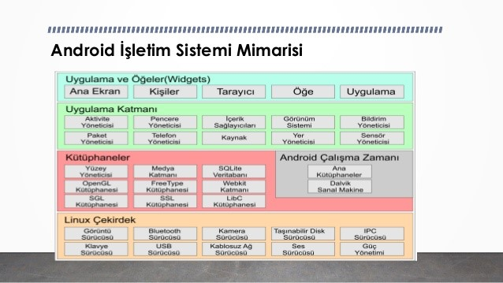
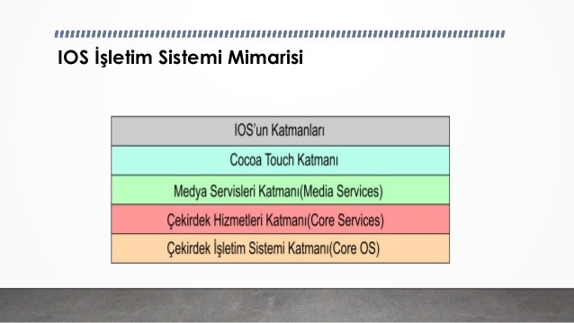

= MOBİL UYGULAMA PLATFORMLARI

Mobil uygulamalar geliştirmek amacıyla kullandığımız platformlara mobil platformlar denmektedir. Bu platformlar kendi içlerinde uyumlu (responsive), çapraz (cross), melez (hybrid) ve yerel (native) olarak ayrılmaktadırlar. Mobil uygulama platformlarının etkin bir şekilde kullanılabilmesi geliştirilen mobil uygulamaların özellikleriyle doğru orantılıdır.

* <<Yerel (Native) Mobil Platformlar>>

** <<Android>>

** <<IOS>>

== Yerel (Native) Mobil Platformlar

Günümüzde Google Play, Apple Store gibi mobil uygulamaların kullanıcılara sunulması işlemlerinin yürütüldüğü mağazalarında türlü gruplar halinde binlerce uygulamaya ulaşım ücretlendirilerek ya da ücret talep edilmeden sunulmaktadır. 
Yerel Mobil Platformlar, günümüzde güncel olan Android ve IOS gibi başka uygulama geliştirme ortamları için başka diller ve geliştirme seçenekleri gerektirirler. Java, Swift ve Objective-C gibi uygulama geliştirme dil seçenekleri bunların başında gelmektedir. Bu bakımdan yerel geliştirme platformlarında her bir ortam için o ortamın isteklerinin karşılanması açısından programlama dillerinin farklı kullanımı söz konusudur. Ayrıca yerel uygulama geliştirme ortamlarında, programlama dili ve cihaz seçenekleri birbirinden farklı değerlere sahip olmalarından dolayı başka uzmanlık alanları ve başka yetkinlikler gerektirir. Aşağıdaki tabloda kullanımı en yüksek dokuz mobil uygulama geliştirme platformu ve bu platformların uygulama geliştirmek için şart sunduğu diller listelenmektedir. 

|===
|MOBİL PLATFORMLAR |GELİŞTİRME DİLLERİ

|Apple IOS
|C, Objective C

|Google Android
|Java(Dalvik VM)

|RIM Blackberry
|Java(J2ME)

|Symbian
|C, C++, Pyhton, HTML/CSS/JS

|Windows Mobile
|.NET

|Windows 7 Phone
|.NET

|HP Palm webOS
|HTML/CSS/JS

|MeeGO
|C, C++, HTML/CSS/JS

|Samsung Bada
|C++

|===

=== Android

Android, kelime kökeni itibariyle insan demek olup, “insanımsı yapıya sahip” şeklinde anlamlandırılmaktadır. Güncel hali ise insan yapısında otomasyon, yani robot anlamında kullanılmaktadır.

Google şirketinin ve Open Handset Alliance’in 2007 yılında geliştirmiş olduğu, mobil ve akıllı cihazlar üzerinde çalışmakta olan, işletim sistemi tarafından desteklenen uygulama uzantısı “.apk” olan, açık kaynak kodlu (open source), ücretsiz bir işletim sistemidir. Geliştirilen uygulamalar, Google şirketinin Google kullanıcılarının uygulama temin ihtiyaçlarını karşılaması için oluşturduğu Google Play üzerinden ücretli veya ücretsiz olarak sunulmaktadır.

.Android İşletim Sistemi Mimarisi
[caption="Figure 1: "]

=== IOS

MacOS (MacintoshOperatingSystem) Apple bilgisayarların kullanımları için Apple şirketinin geliştirdiği C++ ve C programlama dillerinin nesne yönelimli hale getirilmesi sonucu oluşturulan Objective-C diliyle kodlanmış, işletim sistemi haline getirilmiş ve 2001 yılında kullanıcılarıyla buluşturulmuştur. Apple şirketinin ürettiği ve kullanıma sunduğu Macintosh grubunun çıkardığı en son ferttir. Günümüzde akranlarıyla yarışında tercih sebeplerinin başında akranlarına göre daha tümleşik ve derli toplu yapıya sahip olması, çok daha hızlı ve güvenli olmasıdır.

.IOS İşletim Sistemi Mimarisi
[caption="Figure 2: "]
